# Final-project-skeleton

Team Number: 15

Team Name: RobotGirlz

| Team Member Name | Email Address                                        |
| ---------------- | ---------------------------------------------------- |
| Mira Sivaprasad  | [mira10@seas.upenn.edu](mailto:mira10@seas.upenn.edu)   |
| Lubha Churiwala  | [lubha@seas.upenn.edu](mailto:lubha@seas.upenn.edu)     |
| Catie Robinson   | [corobin@seas.upenn.edu](mailto:corobin@seas.upenn.edu) |

GitHub Repository URL: https://github.com/upenn-embedded/final-project-f25-f25-final_project_robotgirlz.git

GitHub Pages Website URL: https://mira10-git.github.io/robotgirlz.github.io/

## Final Project Proposal

### 1. Abstract

The **Hydrobot** is a smart water bottle, which is an intelligent hydration assistant. It will use sensors to monitor the user’s water consumption and encourages regular hydration. The Hydrobot continuously checks the water level in the bottle using an ultransonic distance sensor and counts how many times the user has refilled the bottle. If the user hasn’t drunk enough water for a set time period, the speaker on the bottle will alert the user by making a loud sound. It also measures the water temperature using a temperature sensor. A screen is used to display the measured data, such as water temperature and water level. This project combines sensing, data logging, and feedback control using the ATmega328PB microcontroller. Additional features include showing red light when water is hot, and blue light when water is normal/cold temperature.

### 2. Motivation

Everyone is so busy in their daily lives that, sometimes the basic things such as drinking water or eating food on time are forgotten. Take the example of a university student in UPenn - attending multiple classes + labs related to them, back to back deadlines, sometimes working part-time, perhaps working on projects joining labs, looking for summer jobs, trying to maintain a social life, extra-curricular activities and so on. The list of things to complete in a day is endless. Due to the hustle of life, we forget to drink water -> get dehydrated -> loose energy to complete tasks or survive -> fall sick -> create back logs and the cycle is never ending.
Here's where we are introducing **Hydrobot**, a bottle that reminds you to hydrate yourself.

Additionally, don't we all have a prefered temperature to have our drinks in? Sometimes a little too cold or a little too hot. For example, most university students fall sick, quite often catching a flu during certain months of the season. When you catch a cold, most of us prefer to drink warm water to ease our throat. Even as the weather gets more chilly in Philly, we start avoiding colder water. While getting hot beverages, how many of us have slightly burnt our tongue? I am sure quite a few of us have.
Here's why we are adding the feature of temperature detection, so that everyone can enjoy their drinks in the temperature they'd like and avoid mishaps such as burning your toungue.

These are our motivations to building this project:

* Create an automatic water bottle that would remind us to intake a significant amount of water every hour.
* The bottle gives the temperature read of the beverage inside, so that the consumers can have their preferred beverage in the temperature of their choice (hot/cold).

What also makes our product more interesting are its following features:

* A speaker that talks in the voice of your choice and style that reminds you to hydrate yourself.
* An LCD that tries to interact with the user by showing emojis, temperature value and how much water was drank in that day.
* A switch that lets you choose if you would like the speaker or LCD to interact with you or not (so that the bottle does not create any inconvinience in public places)

### 3. System Block Diagram

### 4. Design Sketches

*What will your project look like? Do you have any critical design features? Will you need any special manufacturing techniques to achieve your vision, like power tools, laser cutting, or 3D printing?  Submit drawings for this section.*

This project consists of a water bottle with smart features acheived with the help of LED strips, speaker, LCD screen, speaker, water level distance sensor and temperature sensor. There will be a case attached to the bottle to encase all the wirings and for the LCD to sit well on the top of the cap. These would require a some 3D printing. The sensors inside the cap will have wires that will be taken out by drilling the cap. Drilling holes for the wiring would require the use of some power tools such as a drilling machine.

### 5. Software Requirements Specification (SRS)

5.1 Definitions, Abbreviations

| Abbreviation | Definition                                                   |
| ------------ | ------------------------------------------------------------ |
| MCU          | Microcontroller Unit (ATmega328PB)                           |
| IR           | Infrared (temperature sensor)                                |
| ToF          | Time-of-Flight or Ultrasonic sensor for distance measurement |
| LCD          | Liquid Crystal Display used for feedback                     |
| LED          | Light Emitting Diode for temperature indication              |
| ISR          | Interrupt Service Routine                                    |
| SRS          | Software Requirements Specification                          |

5.2 Functionality

| *ID*     | *Description*                                                                                                                                 |
| ---------- | ----------------------------------------------------------------------------------------------------------------------------------------------- |
| *SRS-01* | The temperature sensor shall operate and report values every 1 second.                                                                          |
| *SRS-02* | The distance sensor shall operate and report values no longer than 1 second after an operation interrupt is received.                           |
| *SRS-03* | Upon non-trivial temperature change (≥ ±0.5°C), the display shall update within 1 second.                                                    |
| *SRS-04* | The audio processor shall store and play up to 4 pre-recorded 10-second audio files, with playback starting ≤1 second after interrupt trigger. |
| *SRS-05* | When the received temperature enters a new range (cold/normal/hot), the LED color shall change within 1 second.                                 |
| *SRS-06* | The reminder timer shall be user-adjustable between 30–90 minutes through a simple switch or software parameter.                               |
| *SRS-07* | The system shall log daily total water intake (number of refills) and reset the count at midnight or on power-cycle.                            |

### 6. Hardware Requirements Specification (HRS)

6.1 Definitions, Abbreviations

| Abbreviation | Definition                                                                |
| ------------ | ------------------------------------------------------------------------- |
| MCU          | Microcontroller Unit                                                      |
| ToF          | Time-of-Flight sensor which measures distance using emitted light pulses. |
| I2C          | Inter-Integrated Circuit. It is a serial communication protocol.          |
| SPI          | Serial Peripheral Interface. It also is a serial communication protocol.  |
| dB           | Decibel                                                                   |

6.2 Functionality

| ID     | Description                                                                                                                                                                                                           |
| ------ | --------------------------------------------------------------------------------------------------------------------------------------------------------------------------------------------------------------------- |
| HRS-01 | A ToF or ultrasonic sensor shall be used to measure the water level in the bottle. The sensor shall detect levels from 0 cm (empty) to 30 cm (full) with a resolution of less than or equal to 1 cm.                  |
| HRS-02 | A temperature sensor shall measure water temperature in the range of 0 °C - 60 °C with an accuracy of +- 1 °C. Validation: It should be able to measure the temperature of water without being in contact with it. |
| HRS-03 | A speaker shall emit an audible alert of at least 60 dB.                                                                                                                                                              |
| HRS-04 | A bright display shall display water temperature and amount of water drank legibly under typical indoor lighting (atleast 500 lux).                                                                                   |
| HRS-05 | ATMega328PB should operate within its specified voltage range, that is 3.3 V-5V. It should be able to send display signals to the display screen via I2C/SPI.                                                         |
| HRS-06 | Power supply should be suffient to run the peripherals (temperature sensor, water level sensor, display screen, ATMega328PB) continuously without interruption for atleast 4 hours.                                   |
| HRS-07 | Water bottle should be made of metal and it should be able to withstand both hot water (up to 60°C) and cold water (till 0°C) without deformation or leakage.                                                       |

### 7. Bill of Materials (BOM)

Our design relies on 7 major components: 2 sensors to gather data, 3 output peripherals and 2 processors.

| Component          | Descrtiption                                                                                                                                                                                                                                                                                                                                                                                                                                                                |
| ------------------ | --------------------------------------------------------------------------------------------------------------------------------------------------------------------------------------------------------------------------------------------------------------------------------------------------------------------------------------------------------------------------------------------------------------------------------------------------------------------------- |
| Temperature sensor | In order to detect the temperature from the cap of the water bottle we use the Melexis IR temperature sensor. We are choosing this tyoe of sensor over others so that we can keep all of the components inside the cap avoiding wires in the bottle itself and limiting the screw cap functionality of the lid.                                                                                                                                                             |
| Distance sensor    | In order to measure the water level in the bottle we will use a distance sensor not unlike the sensor we used in our thermin lab. The distnace sensor we choose is physcially smaller and can measure smaller changes in distance appropriate for the dimensions of the water bottle. The unit we have chosen also has low power idle  mode that can be interrupted to take data, perfect for our application where we only need to take in  data every 30 mins - 1 hour. |
| LCD screen         | In order to display the temperature and amount of water drank in a day along with character expression we will be using an LCD screen. ( the small LCD screen used in LAB 4 ).                                                                                                                                                                                                                                                                                              |
| LED strip          | To less aggresively indicate the temperature of the water we will use a trip of LEDs that will change color between red and blue depending on the temperature.                                                                                                                                                                                                                                                                                                              |
| Speaker            | In order to output an audible sound volume at an audible frequency we use an 4 ohm speaker as suggested by our audio driver data sheet.                                                                                                                                                                                                                                                                                                                                     |
| ATmega328PB        | For all of the main processing we will use the familiar (to us) ATmega328PB because it has all the necessary I2C, SPI, uart, and GPIO functionalities.                                                                                                                                                                                                                                                                                                                      |
| Audio driver       | In order to store and play audio outside a simple PWM buzz we need an audio processing unit.                                                                                                                                                                                                                                                                                                                                                                                |

Here we have the link to our specific BOM: [BOM LINK](https://docs.google.com/spreadsheets/d/16eDKe1gmb3IbSKQbJabkJTT4pxQ6tuCiqntbFRp6FBk/edit?usp=sharing)

### 8. Final Demo Goals

The demonstation of our device will be simple, not requiring much space or complicated parameters. We will use prepared  hot and cold water to demonstrate the temperature measurement functionality on the LCD and the LED strip. When hot water is in the bottle we will see the temperature displayed change and the LED color change. Whether by drink or pouring our the water into a differnet vessel, we will show that the "amount of water drank today" has also changed. Additionally, to demonstrate the reminder mechanism, we will shorten the period for reminders to ensure that a reminder goes off during the demonstration.

### 9. Sprint Planning

| Milestone  | Functionality Achieved                                                                      | Distribution of Work                                                                   |
| ---------- | ------------------------------------------------------------------------------------------- | -------------------------------------------------------------------------------------- |
| Sprint #1  | Testing the sensors and actuators to check their functionality.                            | Catie - Audio driver, LCD and LEDs, Mira - Temperature sensor, Lubha - Distance sensor |
| Sprint #2  | Successfully triggering correct outputs based on the inputs.                                | Catie, Mira and Lubha - ATMega3208PB software development                              |
| MVP Demo   | Hardware and software of all electronic components working as intended.                     | Catie - Integration of the components, Mira and Lubha - Testing and validation         |
| Final Demo | Fixing issues and any deviation from original, 3D printed system enclosure if time permits. | Catie - Hardware issues, Lubha - Software issues, Mira - 3D Printing                   |

**This is the end of the Project Proposal section. The remaining sections will be filled out based on the milestone schedule.**

## Sprint Review #1 (11.14.2025)

### Last week's progress

Most of the week was spent on formalizing the big picture of the device:

1. A more detailed schematic with specific pins connections was drawn.
2. A code skeleton [link](FINALPROJCODE/main.c) describing the necessary definitions, initializations, ISRs and functions along with a first draft of the main loop was written.

More specific steps toward the final integratation were also taken such as:

3. Emotive reminder display graphics were drawn [HERE](FINALPROJCODE\Display\LCD_GFX.c).
   Demo was shown with the test code where the faces were shown in a loop (the test code is included [HERE](FINALPROJCODE\Display\test1.c)).
   Tested in video linked [HERE](FINALPROJCODE\Display\smiley_test.mp4).
4. Code for audio driver was written linked [HERE](FINALPROJCODE/audio_driver.c).
   UART files for the audio driver [HERE](FINALPROJCODE/uart.c) and [HERE](FINALPROJCODE/uart.h).
5. I2C iniitlaization from the ATmega was written link [here](FINALPROJCODE/lib/i2cdriver.c).

### Current state of project

Generally we are about halfway through the neccesary code for the project which gives us plenty to work on as we continue our wait for parts.

We have tested the LCD Display functions and can confirm they are working as seen in the video [HERE](FINALPROJCODE\Display\smiley_test.mp4).

We have a good start on all the remaining code and are about to be ready to test the parts.

### Next week's plan

As we wait for our parts, our plans for next week involve finishing the code for the remaining parts, more specifically, writing the functions that will interpret the data from the sensors and the LED color changing output function (more complicated than it seemed at first).

While we do this (hopefully) our parts will come in and we will be able to test functionality with the freshly written code. As we start working with parts we'll also test and implement the power supply. To organize our plans we have created a Gantt chart documenting previous work and our plans for the necessary future work.

**Created Gantt Chart**

## Sprint Review #2 (11.21.2025)

### Last week's progress

**Temperature Sensor:**

* We completed the code linked [HERE](FINALPROJCODE/src/tempi2c.c) and did first tests (using code linked [HERE](final_one_at_a_time/src/testingzone.c)) on the I2C temperature sensor.
* Some timing details and temperature calculation adjustments are still needed to ensure accurate outputs every single time, but calibration values temperature measurements can all be read from the sensor!
* Images of the correctly read out calibration constants are linked [HERE](images/gettingcalbiconstants.png).
* Image displaying expected delay between setting the start measurement bit and taking the measurements are linked [HERE](images/.5sdelay).
* Image of the ATMega328PB successfully reading all 18 registers necessary for calculating object temperture is linked [HERE](images/18registers.png).

**Audio Driver Implementation with Speaker and Amplifier:**

* There were some road bumps we faced with integrating our intial speaker (Speakers & Transducers Speaker - 40mm Diameter - 4 Ohm 5 Watt) with the Mini audio driver. This was because our the MINI audio driver did not have an amplifier and this was not compatible with the speaker.
* The speaker model was changed to 'Adafruit STEMMA Speaker with the Audio Amplifier'. This was the right model compatible with the Mini audio driver.
* Initially the implementation was done with the UART setup so that lesser pins from the ATmega328PB is used. The code for this is linked [HERE](/FINALPROJCODE/audio_driver.c). This was getting a little heavy on time to debug which is when we realised GPIO setup would be much easier (and we did have enough spare pins on the ATmega too!).
* With the GPIO setup, we were able to successfully load and play four different files from the audio driver through a speaker. Each of these four files represented four different personalities (happy, angry, sad, sassy). The code used for this is linked [HERE](FINALPROJCODE/src/speaker.c) and the video displaying this implementation is linked [HERE](images/audioplayvideo.mp4).

**LCD display updates:**

* Successfully updated the LCD display code to display temperature and water level values along with the personality expression.
* These faces are also included in a function that will change the face according to the input, ready for integration with timer.
* The temperature and water level values are hardcoded into the test code right now.
* The test code is attached [HERE](FINALPROJCODE\Display\test2.c).
* A video of the demo is attached [HERE](FINALPROJCODE\Display\smiley_test_sprint2.mp4).
* In the video, it can be seen that the temperature and total water drank values are being displayed beside the smiley faces.
* A push button is used to switch between the five faces. This is because the push button will be used as per the user input to change between the different modes in the final model also.

**Water Level sensor updates:**

* One less successful update is the reworking of how the water level implementation in our design will be.
* In starting the code for the I2C of the orginally planned on distance sensor, we found that the datasheet did not give the neccessary information for implementation (did not list the registers, necessary initializations, or what read data would look like).
* Our first backup plan was using the ultrasonic sensor, previously used for our theremin lab. Unfortunately it did not meet the necessary requirements either, as the wide field of sensing of the ultrasonic rays meant that the sensor would detect the sides of the water bottle before it detected the water.
* We then looked into the proximity sensor. However, that would not work either because it used infrared rays and it is meant to detect opaque or heavily coloured objects, while water is transparent.
* From here we started planning other methods of water level detection, both using ADC that we will test and decide on Saturday:

1. Homemade resistive water level sensor in the water. There are two options to implement this:

- The first method was to solder a series of multiple resistors (5-6 resistors) and the end of each resistor represents the water level.
- The second method was to connect each resistor to a transistor and arrange them parallel to each other. The wires from each transistor goes inside the bottle arranged in a line. The transistor gives signal out, providing the water level information.

2. Weight sensor outside the water bottle.

### Current state of project

Currently, we have four major updates:

* Successful temperature sensor implementation.
* Successful audio driver implementation with speaker + amplifier.
* Improved LCD output functions with temperature and water level displayed, controlled by a pushbutton.
* Reworking of the waterlevel sensor model.

The updated electrical schematic can be seen below:

The updated Gantt Chart can be seen here:

To sum up, we have 3/4 of our major components working, a plan for our final component of the water level sensor, and a start on the main function that integrates all of them (linked [HERE](/FINALPROJCODE/src/main.c)).

### Next week's plan

For the next week, we will try to achieve the following milestones:

* Working on some improvements with certain individual components - Saturday (Catie)
* Working on power requirements - Saturday (Mira)
* Water level sensor implementation - Saturday (Catie and Mira)
* Integration of all sensors together - Saturday (Lubha)
* Testing all sensors together - Sunday (Catie, Mira and Lubha)
* Mechanical design specifications - Sunday (Mira)
* Getting ready for the MVP Demo!!

## MVP Demo (11.25.2025)

**1. Show a system block diagram & explain the hardware implementation.**

.png>)

From our proposal to now we had to adjust a few components.

* For water level sensor:
  Our original plan for our water level detection implementation (ToF distance sensor) turned out to be much more difficult to implement than not (no register description in its datasheet or user manual)
  Back up plan of the ultrasonic sensor from lab 3, was also unable to perform in our context.
  From here we tested multiple different options for sensing waterlevel before landing on stacking five 2 inch Analog output resisitive waterlevel sensors and making use of the on board ADC mux to sample the value from each of these sensors and adding up their returned ADC values.
* For audio driver:
  There was a change from our original plan is the comminication between the audio driver and the MCU.
  We had orginally planned on using the audio drivers UART capabilities to play the desired audio track but have sice switched to using GPIO signals for this functionality, for the sake of firmware simplicity.
* LEDs were eliminated for the sake of simplifying the design.
* Linear regulator is being used instead of a buck converter for power management.

Unchanged parts of our hardware include:

* An IR tmeperature sensor reading object temperature and communicating through I2C
* LCD screen displaying the input information received through I2C.
* Most of our components are able to run off of a 5V input that we get from the linear regulator. Some, however, require 3.3V, namely the temperature sensor and the analog water level sensors.
* However, separate power regualtion is not needed for these, since we are able to pull the 3.3V from the ATmega's 3.3V supply pins and the on board regulation included with the temperature sensor breakout board.

**2. Explain your firmware implementation, including application logic and critical drivers you've written.**

All our codes used for MVP demo are in the [MVP_Demo](MVP_demo) folder.

* Our [main function](MVP_demo\main.c) starts by initializing ATmega's methods of communication with its peripherals: initializing GPIO pins (for button input and audio dirver output), ADC functionality and I2C functions.
* Then, we initialize our peripherals themselves: the LCD through SPI and the temperature sensor through I2C (writing to its control register the value corresponding to our desired mode of operation).
* The application itself runs within the while loop, where the functions that capture and process data from our two inputs (gettemp and mlWL) runs and then the function that updates the screen to display these values is implemented.
* An "if statement" polls for a change from a button. It changes the personality displayed and audio played according to specified cases. The default state is a happy reminder. When the button is pushed the reminder becomes sad, then angry, then wink and then bored (idle state). There is no audio file in DND mode (bored).
* The trigger to play the audio file is by polling for a counter value that is updated by timer overflow interrupt. This last timer intergation is still to be done, but at the moment the other capabilities of our device our working with room for quality improvement through button debouncing, garbage rejection, and display update delay optimization. Right now our device is a water bottle that tells you the temperature and waterlevel of your water with an accommanying face of your choice while playing a corresponding hydration reminder once when the personality change occurs.

**3. Demo your device.**
  Demo was done in person with our Account manager. All the components were integrated (LCD screen, push button switch, speaker and audio driver, temperature sensor and water level sensor ), and the information was displayed on the LCD screen. This video, [Demo video](images/MVP%20operation%20(less%20explanation).mp4), shows the LCD screen displaying the temperature readings taken from the temperature sensor and the water level readings taken from the water level sensor. The speaker plays the audio file in the background and the switch is used to change the personalities.

**4.  Have you achieved some or all of your Software Requirements Specification (SRS)?**

We have acheived most of our Software Requirements Specifcations:

- SRS-01 -> The temperature sensor shall operate and report values every 1 second. It reports values in degrees celsius every 100ms. Every few measurements the sensor gives a bad reading, and thus returns garbage values. This worsens when the device is integrated with all the otehr components. This problem can be fixed by rejecting these bad reads through software implementation.
- SRS-02 -> The distance sensor shall operate and report values no longer than 1 second after an operation interrupt is received. A water level sensor was used to implement the same functionality of the distance sensor and reports values within 1 second due to the timing requirements for the ADC.
- SRS-03 -> Upon non-trivial temperature change (≥ ±0.5°C), the display shall update within 1 second. The display updates the screen within 1 second after the temperature  or water level is reported. Delays longer than this can occur when pesonality is reset and the entire display must update.
- SRS-04 -> The audio processor shall store and play up to 4 pre-recorded, 10-second audio files, with playback starting ≤1 second after interrupt trigger. The audio processor stores 4 prerecorded audio files, but plays them back up to 2 seconds after the pin is set.
- SRS-05 -> Color changing LEDs have been removed from the scope of the project.
- SRS-06 -> The timer period is modifiable through software parameter.
- SRS-07 -> The system was supposed to log daily total water intake (number of refills) and reset the count at midnight or on power-cycle. It does not do this.

  a. Show how you collected data and the outcomes.

  - Readings of Temperature sensor (SRS-01):
    The code that is used to test the temperature sensor is linked [Link Text](/final%20one%20at%20a%20time/test/temptestcode.c)
  - Below the reading of the caliberation constants can be seen:
  

  - Below the starting measurement and the reading from the appropriate registers can be seen:
  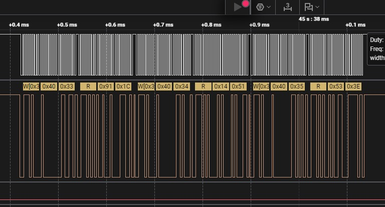

  - And here we have the readings for one temperature measurement all happening in a timely manner:
  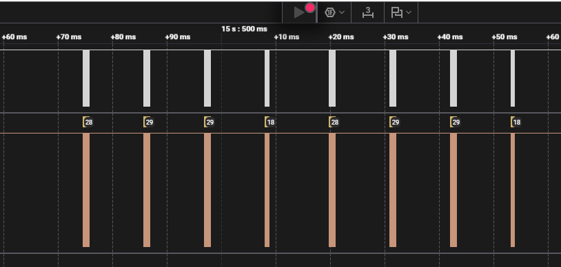
  - Readings from the LCD (SRS-03):
   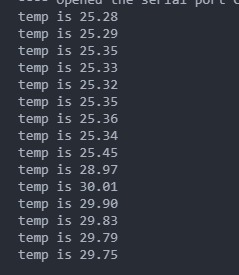

**5. Have you achieved some or all of your Hardware Requirements Specification (HRS)?**

* HRS-01 -> We used a water level sensor from Adafruit, linked here: [Adafruit water level sensor](https://www.adafruit.com/product/4965). It detects the specified range of water levels. returning values with a precision of 1 ml and an accuracy of +-10 ml. This is reasonable for our applications because our "amount of water you should have drank in the last hour " is on the order of 100 ml
* HRS-02 -> Temperature sensor is measuring the temperature of the water and detects the specified temperature range, with precision of .1 degrees celsius, and accuracy varying depending on the temperature of the object.
* HRS-03 -> A speaker connected to an audio driver gives audio alert in four different personalities. The sounds are audible.
* HRS-04 -> The LCD display shows the water temperature, the current water level and the mode in which the bottle is in at the moment legibly under typical indoor lighting.
* HRS-05 -> ATmega328PB is working within its specified range. It is used to integrate all the sensors. I2C and SPI is implemented for serial communication.
* HRS-06 -> A battery of 9V is used with a linear regulator  to give an output of 5V sufficient enough to run four peripherals continuously without interruption for hours.
* HRS-07 -> Since we couldn't find a metal water bottle with a big enough lid to fit all the sensors, we chose a plastic bottle. It is able to withstand both hot and cold water without deformation.

  a. Show how you collected data and the outcomes.

  To ensure the temperature sensor reported data form one temperature measurment in a timely manner we used the logic analyzer. Here we see the sets of register readings for temperature measurement come through in <100ms:
 

  To check that the system was able to receive and process information from both sensors, we used the code linked here [LINK](/final%20one%20at%20a%20time/test/temp%20and%20waterlevel.c)
  From this we found that the waterlevel and temperature were able to update as expected, the temperature rises when a warm object is palced in front of it while still reporting the current water level:
  

  Reading the voltage output from the linear regulator can be seen below (HRS-06):
  Below a voltmeter is used to measure the voltage output caliberating power requirements:
  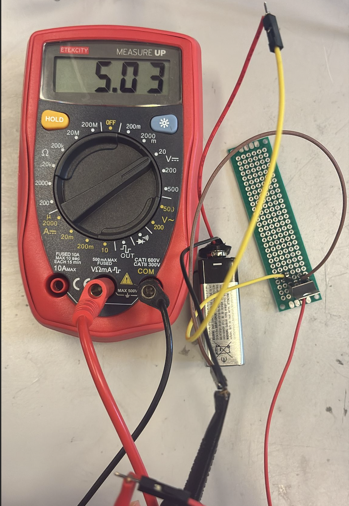

**6. Show off the remaining elements that will make your project whole:**

The final step for our project will be afixing all the parts to the waterbottle itself. Do to this we've design mechanical casework to enclose the parts.

The mechanical case work can be seen below:
Figure 1:
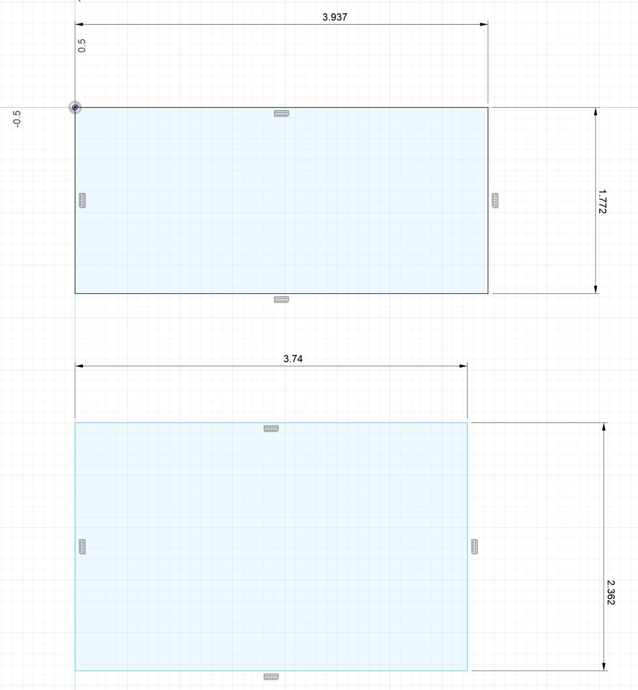
Figure 2:
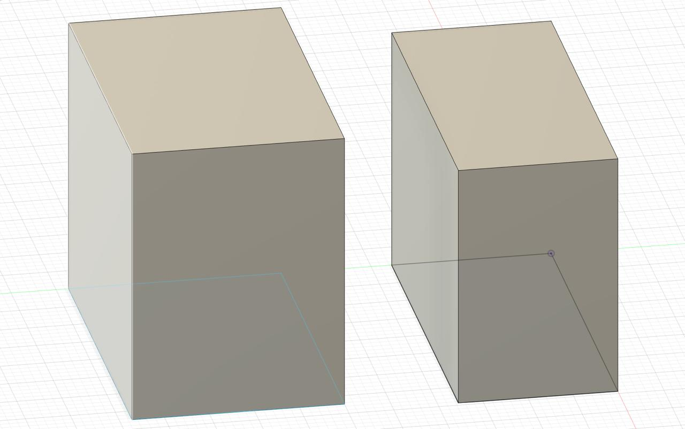
Figure 3:
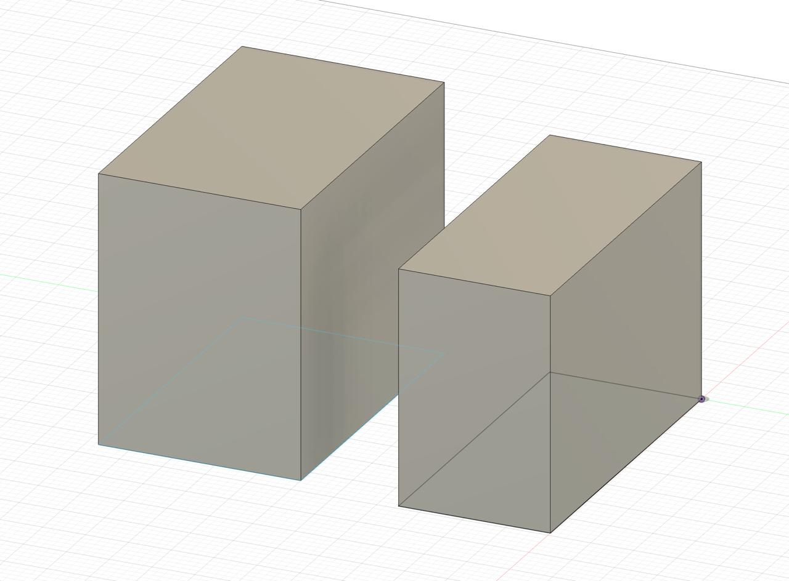
There are two versions for the mechanical design. Under Figure 1, the top design is expected to go above the lid, so that all the different components in the breadboard and microcontroller is neatly placed on top. However, if this does not work out then the design below it (in Figure 1), with slightly different measurements, will be placed along the handle. The second design is a back-up design plan. The 3D version from different angles can be seen in Figure 2 and Figure 3.

Once the other parts have been put together we could potentially go further integrating graphical user interface (GUI), web portal, etc.

**7. What is the riskiest part remaining of your project?**
Intergation has proved to be a tall mountain to cross. All of our different component require many wired connections, and so parasitics from using all of these wires at once has had a larger affect than anticipated (e.g. sensors that return accurate data when printed from the serial moniter, have more garbage readings when integrated). Additionally the quantity of wires leads to not-easily-noticed loose connections and physical limitations on the spacing of components.

Wires in circuit set up here:
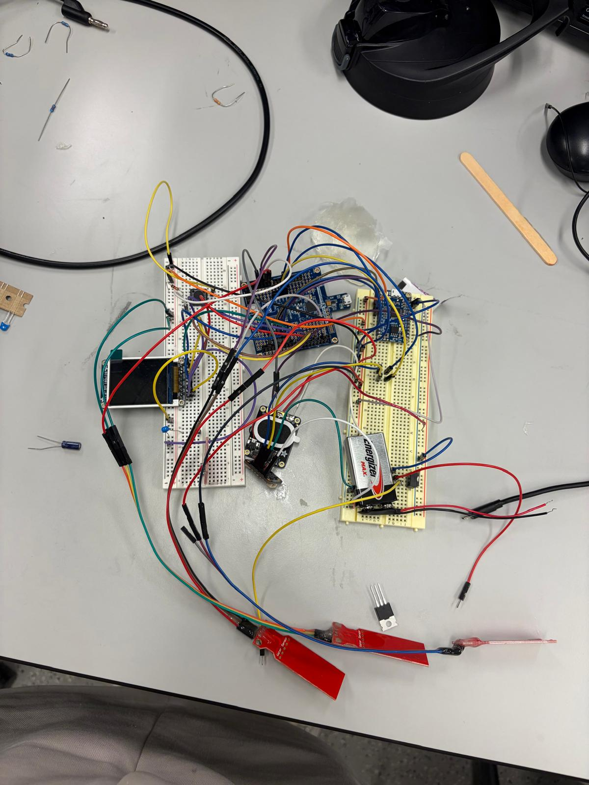

Aside form the wires, our use of a linear regualtor to go from 9->5 volts leads to a lot of dissapated power and hot compenents, risking damage to our power integration set up.

Enabling the necessary interrupts for the timing aspect of our device, seems to cause (not unexpected) timing issues for the rest of the components (blocking during the middle of an I2C read or an SPI transfer). So, intergating this seemingly simple final aspect could risk ruining the processes for other components.

   a. How do you plan to de-risk this?
   Rewiring with more intentional color-coding and placement, along with further securing connections between wires (with glue or electrical tape), should help limit the influence of parasitics and improve connections. Keeping the hot regulator as far form the other components as possible will also help lower the risk of damage.

**8. What questions or help do you need from the teaching team?**
How do interrupts affect serial communication?

## Final Project Report (12.05.2025)

Don't forget to make the GitHub pages public website!
If you’ve never made a GitHub pages website before, you can follow this webpage (though, substitute your final project repository for the GitHub username one in the quickstart guide):  [https://docs.github.com/en/pages/quickstart](https://docs.github.com/en/pages/quickstart)

### 1. Video

The final project video is linked here: [Final Website](https://drive.google.com/file/d/1J3wb_-LD5Ea_SrVyvrk9SyJ9oD1yoAxu/view?usp=share_link)

### 2. Images

[Insert final project images here]

*Include photos of your device from a few angles. If you have a casework, show both the exterior and interior (where the good EE bits are!).*

The speaker fit to the case can be seen below:

The LCD screen mounted on the case can be seen here displaying 5 different modalities can be seen there:

The temperature sensor placed inside the bottle cap can be viewed here:

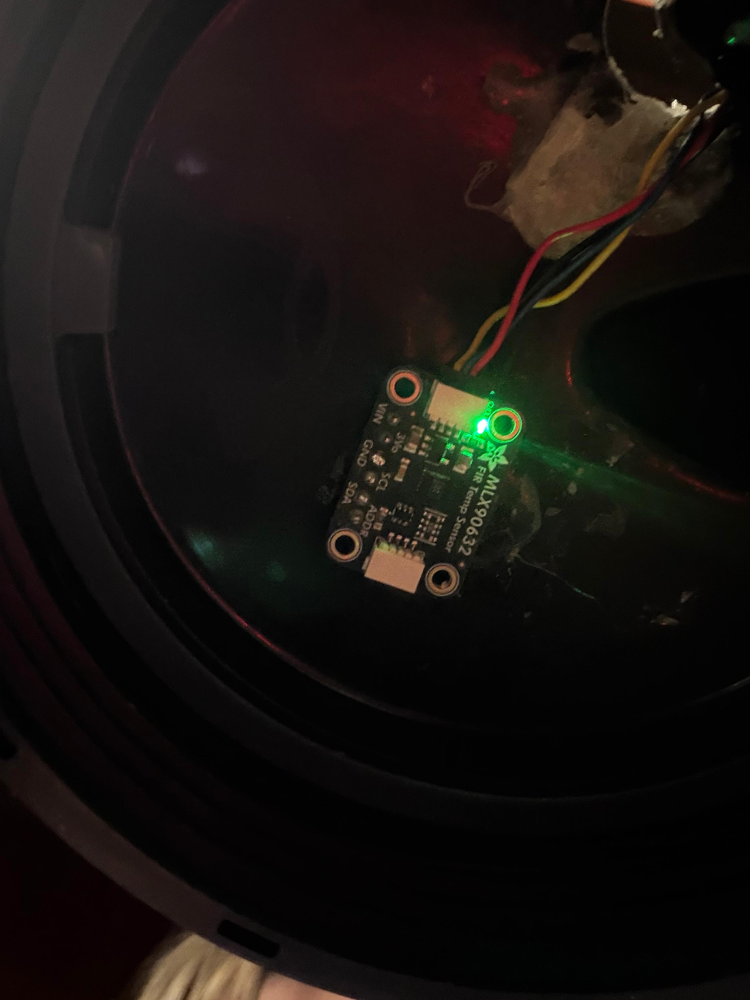
The customised stacked up water level sensor can be seen below. The first image shows how it is placed inside the bottle and the second image gives a clear image on the stacking of 5 differet individual water level sensors to create a one long one:

Below the interior of the mechanical casing can be seen.
It has securely placed the ATmega328PB, the speaker and the breadboard along with all wirings:
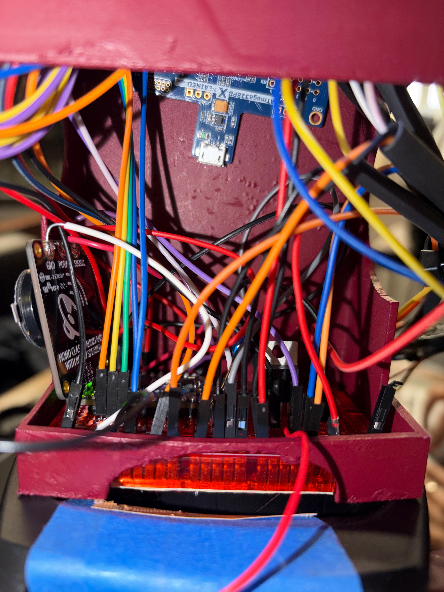

Below the exterior of the mechanical casing can be seen:
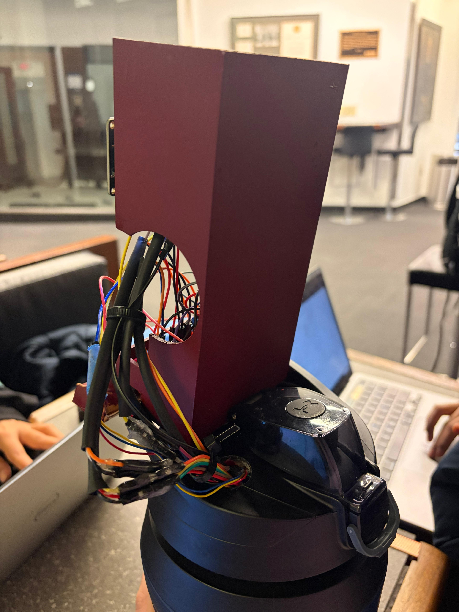

Below the extended battery case taped up to the bottle can be viewed:

### 3. Results

*What were your results? Namely, what was the final solution/design to your problem?*

**All our code used for the final demo are placed in the Project Demo Code folder. Linked [HERE](Project_Demo_Code).**

Our final result is that we created a bottle that gives regular reminders to drink water every hour depending on the water level inside the bottle, while also displaying the temperature of the water inside.

* Temperature sensor
  * The device consistently measures the temperature through an infrared object temperature sensor operating in its extended range, that communicates to the MCU through I2C.
  * Additionally, when the temperature of the bottle is more than 30 degree celcius, a red LED would light up indicating that the water is hot. Similarily, when the temperature of the bottle is less than or equal to 30 degree celcius, the blue LED would light up, signifying the water is colder in temperature.
* Water Level Sensor
  * The device also consistently measures the water level through resistive analog waterlevel sensors that are read by the MCU using ADC with its internal 1.1 V reference voltage.
* LCD screen
  * The raw data from each of the sensors was reinterpreted by the MCU to return values in degree celsius and mililiters respectively. These values are then displayed and periodically updated by an LCD screen that communicates to the MCU via SPI.
  * Alongside the displayed values is a color coded emoji associated with a particular personality option.
* Personality modes and speaker
  * We were able to create five different modes: Happy, Sad, Angry, Sassy and Bored.
  * Additionally, a speaker with in-built amplifier was used so that the reminder was not only visual but also auditory. These audios were customised in accordance to each personality modes.
  * The last mode (bored) is a 'DO NOT DISTURB' mode which means, the speaker will not be playing anything at that time. This mode can be taken advantage of when the user is in public place and do not prefer to be disturbed woth load noices. These personality modes can be changed at a click of a button.
* Since, there are both visual and auditory reminders, this bottle can be additionally helpful for both deaf and blind people.

#### 3.1 Software Requirements Specification (SRS) Results

*Based on your quantified system performance, comment on how you achieved or fell short of your expected requirements.*

We acheived the following software functionality:

* Getting values from waterlevel sensor and temperature sensor.
* Having the audio files play audible audio according to the display in the LCD which changes at every click of a button.
* Two individual LEDs (blue and red) that indicate temperature of the water.
  We wanted to have a display of a string of color changing LEDs to show if the water was hot or cold. However, this was a tough software implementation as far as bare metal coding was concerned. It would have also added additional pressure on the memory use of the ATmega328PB. So instead, we deliberately used a simplified logic of the same idea and iplemented just two LEDs.

*Did your requirements change? If so, why? Failing to meet a requirement is acceptable; understanding the reason why is critical!*

Water level sensor - no change from the software requirement

Audio - no change from the software requirement

Only one of our software requirement was changed. From using a strip of LEDs that changes color to using 2 individual LEDs indicating red for hot water and blue for cold water. The reason this chnage was made was because it was much easier to implement code-wise and much efficient memory-wise.

*Validate at least two requirements, showing how you tested and your proof of work (videos, images, logic analyzer/oscilloscope captures, etc.).*

| *ID*     | *Description*                                                                                                                        | Validation Outcome                                                                                                                                                                                                                                                                                                                                                                        |
| ---------- | -------------------------------------------------------------------------------------------------------------------------------------- | ----------------------------------------------------------------------------------------------------------------------------------------------------------------------------------------------------------------------------------------------------------------------------------------------------------------------------------------------------------------------------------------- |
| *SRS-01* | The temperature sensor shall operate and report values every 1 second.                                                                 | Confirmed. The IR temperature sensor starts and completes the 3 measurements necessary for an object temperature reading in < 100ms.As shown in the image below                                                                                                                                                                                   |
| *SRS-02* | The water level sensor shall operate and report values no longer than 1 second after the opateration starts .                         | Confirmed. The analog water level sensors are continuously providing an input voltage to the ADC. Since the ATmega328PB's ADC is already enabled in single conversion mode after initialization mode, each ADC reading takes only takes 13 clock cycles, or 1.04ms from a 12.5kHz clock frequency (16Mhz with a 128 prescaler), making the enitre waterlevel reading procedure take <6ms |
| *SRS-03* | Upon non-trivial temperature change (≥ ±0.5°C), the display shall update within 1 second.                                           | Confirmed. The LCD screen updates at least twice every time the processor cycles though our main while loop taking TIME.                                                                                                                                                                                                                                                                  |
| *SRS-04* | The audio processor shall store and play up to 4 pre-recorded 10-second audio files, with playback starting ≤1 second after trigger. | Confirmed. A signal comes trhough the speaker at 180ms after GPIO trigger as seen in the imag ebelow                                                                                                                                                                                                                                                                                                        |
| *SRS-05* | When the received temperature enters a new range (cold/normal/hot), the LED color shall change within 1 second.                        | Confirmed. When the temperature changes the LED color updates on the next cylces of our while loop (the loop may take longer )                                                                                                                                                                                                                                                            |
| *SRS-06* | The reminder timer shall be user-adjustable between 30–90 minutes through a simple switch or software parameter.                      | Confirmed. The timer period can be adjusted through the software parameter called ""PERIOD""                                                                                                                                                                                                                                                                                              |
| *SRS-07* | The system shall log daily total water intake (number of refills) and reset the count at midnight or on power-cycle.                   | Unconfirmed. The size of our water bottle made this functionality unnecessary.                                                                                                                                                                                                                                                                                                            |
SRS-01 Temperature timing verification:

SRS-04 Audio timing verification:
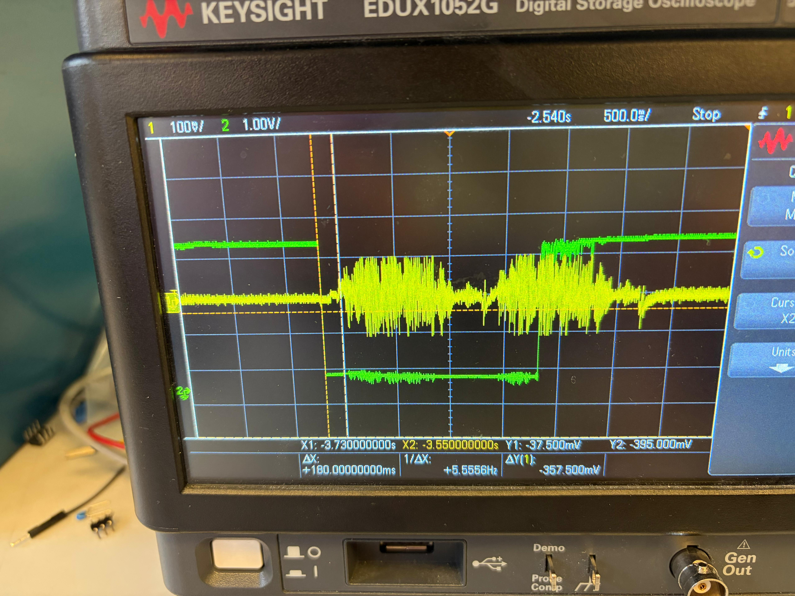

#### 3.2 Hardware Requirements Specification (HRS) Results

*Based on your quantified system performance, comment on how you achieved or fell short of your expected requirements.*

We were able to achieve all our hardware requirements:

* Components
  We wired the temperature sensor, customised water level sensor, speaker connected to the audio diver, LCD screen connected to 2 different colored LEDs and a button.
* Power
  For power, we used four 1.5V AA batteries that adds up to 6V. Then, used a linear voltage regulator to step down the voltage to 5V (which was the highest voltage required to power all components). This was then connected to ATmega328PB from where 5V input was delivered to the temperature sensor, LCD screen and speaker attached to the audio driver. The 3.3V input was used to operate the water level sensor.

*Did your requirements change? If so, why? Failing to meet a requirement is acceptable; understanding the reason why is critical!*

Our hardware requirements did not change much. While the exact specification did not match the requirements specified initially, the functionality matched the requirements. We did make slight changes in power regulation. Initially a single 9V battery was connected to a buck-boost convertor to step down voltage. However, the buck-boost convertor in the lab was faulty. This is when we switched to a linear voltage regulator. Since the step-down was from 9V to 5V, it heated up the voltage regulator quickly and it also seemed like a non-efficient set up. At this point, we switched to using four 1.5V batteries, which steps down voltage from 6V to 5V. This power setup was much more efficient and simpler than the earlier one.

*Validate at least two requirements, showing how you tested and your proof of work (videos, images, logic analyzer/oscilloscope captures, etc.).*

| ID     | Description                                                                                                                                                                                                           | Validation outcome                                                                                                                                                                                                                                                                                                                                            |
| ------ | --------------------------------------------------------------------------------------------------------------------------------------------------------------------------------------------------------------------- | ------------------------------------------------------------------------------------------------------------------------------------------------------------------------------------------------------------------------------------------------------------------------------------------------------------------------------------------------------------- |
| HRS-01 | A ToF or ultrasonic sensor shall be used to measure the water level in the bottle. The sensor shall detect levels from 0 cm (empty) to 30 cm (full) with a resolution of less than or equal to 1 cm.                  | Unconfirmed. A cascade of resistive waterlevel sensors were used and detected the water level from 0 mL to 1900 mL with an accuracy of +- 100mL, with higher quality reported values at higher volumes. This is suboptimal perfomance due to the varying floating charge that exists on the water level sensors that are not in use (wet) at a given time. |
| HRS-02 | A temperature sensor shall measure water temperature in the range of 0 °C - 60 °C with an accuracy of +- 1 °C. Validation: It should be able to measure the temperature of water without being in contact with it. | Unconfirmed. The temperature sensor accurately measures the temeprature of the water from 0°C - 40 °C. At hot temperatures the steam in the bottle clouds the sensor, blocking it from reading the water itself.                                                                                                                                           |
| HRS-03 | A speaker shall emit an audible alert of at least 60 dB.                                                                                                                                                              | Confirmed. The reminder is audible.                                                                                                                                                                                                                                                                                                                           |
| HRS-04 | A bright display shall display water temperature and amount of water drank legibly under typical indoor lighting                                                                                                      | Confirmed. The screen is bright and visible.                                                                                                                                                                                                                                                                                                                  |
| HRS-05 | ATMega328PB should operate within its specified voltage range, that is 3.3 V-5V. It should be able to send display signals to the display screen via SPI.                                                             | Confirmed. The ATMega328PB is able to operate via battery power                                                                                                                                                                                                                                                                                              |
| HRS-06 | Power supply should be suffient to run the peripherals (temperature sensor, water level sensor, display screen, ATMega328PB) continuously without interruption for atleast 4 hours.                                   | Confirmed. The system was left on for an afternoon and still operated normally throughout.                                                                                                                                                                                                                                                                    |
| HRS-07 | Water bottle should be made of metal and it should be able to withstand both hot water (up to 60°C) and cold water (till 0°C) without deformation or leakage.                                                       | Unconfirmed. The water bottle is plastic, but its still able to withstand the range of water temperature.                                                                                                                                                                                                                                                     |

### 4. Conclusion

Reflect on your project. Some questions to address:

* **What did you learn from it?**

  From this project, we got a wholistic view of the development process of an embedded system prototype. From planning out desired functions and building bill of materials, to testing individual components and final integration, this project expanded upon what we learned in ESE 5190's worksheets and labs, giving us one specific design where we had to implement everything we'd been learning about from scratch. Learning how to navigate multiple datasheets for desired information, write code for I2C communication for a device, find the necessary initializations for desired implementation, set up a linear regulatior, and how putting all these pieces together affected entire system operation, was all necessary for the succesful operation of our final design.

  We also gained experience with the arduous debugging process, isolating each component one by one. This is a very important skill for when we are working in the industry as most of the times, the components that work fine individually, stop working during integration and so, finding the root cause of the issue is a very complex problem. The project gave us hands on experience with bare metal coding, which one of our team members had had little to no experience with before. We learned individually about the intricacies of each main component: the temperature sensor, water level sensor, LCD screen and speaker and audio driver and how to integrate these together using ATmega328PB. We also got some experience in 3D designing and 3D printing.
* **What went well?**

  Many aspects of our project went well. Most notably the speaker with an in-built amplifier attached to the audio driver worked very well. There were no complications during any of the testing sessions and the audio were quite audible clearly differentiating between four different personality mode voices. Additionally, though it was the first part to be affected by integration bugs, the LCD screen also consistently displayed the information reported from the ATmega, giving us a clear place to look to see if there was an issue. If the code was hung up, we could see the LCD freeze, if a sensor wasn't working right we could see the garbage value on display, or if a button wasn't debouncing properly we could see the effect directly. This really helped with the debugging process.
* **What accomplishments are you proud of?**

  We were particularily proud of implementing the temperature sensor. Since it communicated through I2C,it required a lot of firmware implementation specific to the part itself. It took a lot of time to research, write code for, and test the necessary initializations, calibrations, and measurement start parameters, along with the firmware required to turn the raw data from the sensor into information that was interpretable. The temperature sensor took to most time to intergate with other parts, because the lack of an expected acknowledgement from the peripheral would hang up the entire application function. It was very rewarding when we figured out what was going on and got everything to work (code will get hung up waiting for an ACK if we did not have our I2C peripherals plugged in). Aside from the temperature sensor, finally putting everything together was very exciting even if it did take significant time and effort. The working of the entire project felt worth the effort.
* **What did you learn/gain from this experience?**

  In addition to the general practice applying what we learned in the course, we also learned how executing a project like this takes a lot of time, trial and error, testing, and adapting and overcoming the inevitable obstacles along the way. We learnt how we can approach the same problem in multiple ways. For example, we tried many different methods to measure the level of the water inside the bottle. This showed us that it is okay not to be stuck if the original plan did not work out, and that we can improvise when needed.
* **Did you have to change your approach?**

  Yes, due to many factors like time and feasibility, component compatability and information availability, we did have to change our approach to a few functionalities multiple times.

  * We changed from using neopixel LED strips to individual LEDs to indicate water temperature. This was due to the complexity of the LED strips communication proccess that would have taken too much time that was better spent improving other parts of the device.
  * The speaker model was changed to one with an in-built amplifier to simplify the design instead of the two separate amplifiers required to boost the signal enough for the original 5W speaker.
  * Most notably, our approach to sensing the water level completely changed from a distance based sensor to a stack of 2-inch resistive waterlevel sensors.

    1. This change was initialy due to our first chosen part having intentionally incomplete documentation, due to the part manufacturers wanting the user to only implement the device using their API library to guarantee quality. This made it near impossible to write the necessary I2C code for the device.
    2. From here, our first back up plan was to use the ultrasonic sensor we had experience with from class.
       This however also did not work for our application, as the field of view of the ultrasonic sensor was too wide for the water bottle. It would sense the walls of the water botle before the water.
    3. After these, we looked into how typical resistive water level sensors operated.
       We had initially avoided many of these parts during our initial proposal because of their size, either being too big to fit in our initial bottle choice or too short for the length of the bottle.
       We looked into multiple options from here: a load sensor that communicated through I2C, two homemade water level sensor deisgns, and the two in-factory made water level sensor.
    4. From here we went with this final option since it had the most consistent behavior that we could implement in the remaining time we had. It took some more effort than anticipated, but we eventually got it working where it would return values reasonable for the set up.
* **What could have been done differently?**

  The final water level sensor implementation could have gone a lot differently. We could have continued researching other options or ordered different back up plan that would have avoid the floating charge errors we get now, but for the options and time we had our design is reasonable. A different water level set up would also avoid the issues of the waterlevel sensor blocking the temperature sensor when taking its readings.
* **Did you encounter obstacles that you didn’t anticipate?**

  Yes, we encountered obstacles that we did not anticipate:

  - It was a challenge to integrate the temperature sensor with the rest of the electrical components. The water level sensor would interrupt with the temperature sensor and force it give incorrect readings initially.
  - We went through 3 different set ups to measure water level sensor before we got a customised version working. The individual sensors were glued together with epoxy and they kept coming off with the different kind of testing we did (as the prolonged exposure to warm/hot water softened the glue).
  - The speaker module we were using initially was not compatible with the audio driver.
  - The buck-boost converter was faulty and the linear regulator heated up quickly due to the larger step down voltage value.
  - There were multiple versions of the 3D design (that did not fit the purpose of the design) before we finalised on a casing with apt form and function.
* **What could be a next step for this project?**

  There could be multiple improvements to this project:

  - The mechanical casing can be an enclosed box with a latch system. Such a design would encompass all components without anything been shown outside. This was not implemented in the prototype so that all internal setup could be clearly seen during the demo.
  - We could have prototyped boards. This way all the wiring set up would be customized.
  - There are commercial water level sensors that could be used. It would give more accurate and consistent readings than the customised one that we have used in the prototype.
  - The temperature readings works best for lower temperature than higher water temperature. So the sensor could be worked on more, in order to recieve better readings even at higher temperatures.
  - The LED strips could be further implemented, such that it displays a range of colors. For example, a range of red/blue could be shown as the temperature varied.

## References

Fill in your references here as you work on your final project. Describe any libraries used here.
